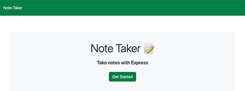
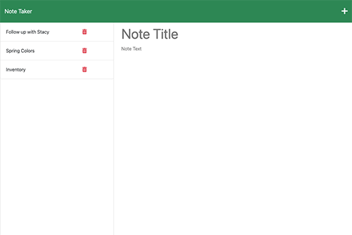

# take-note

## Description

This application allows a user to write and save notes. It was created using front end starter code which I connected to the back end using Express.js.

[click here to access my application](https://hidden-fjord-54822.herokuapp.com/)

## Table of contents

- [Description](#description)
- [Usage](#usage)
- [Visuals](#visuals)
- [Questions](#questions)

## Usage

This app can be used to create and store notes so that the user can keep their thoughts and tasks organized in one easily accessible place. This app also allows for note deletion once they are no longer needed.

## Visuals

Images:

## Questions

For any further questions please reach out via:

[Github](https://github.com/mariahmcdaniel)

[Email](mailto:mariahmcdaniel@icloud.com)
